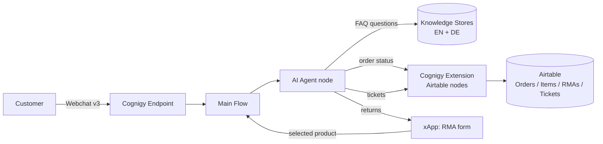

# Aurora Outdoors — Customer Service AI Agent

A customer service agent for Aurora Outdoors, a fictional European outdoor-gear retailer,
built on Cognigy.AI. Developed for the Cognigy Forward Deployed Engineer technical
assessment. Order data is mocked in Airtable; all integrations are live.

## Capabilities

| Capability | Implementation |
|-----------|----------------|
| FAQ answering | Cognigy Knowledge AI, 12 FAQs per language (EN and DE) |
| Order status lookup | Custom Cognigy Extension calling the Airtable REST API |
| Product returns (RMA) | xApp form populated with the customer's order items; selection written back to Airtable |
| Support tickets | Ticket records created in Airtable with a confirmation number |
| Two languages | English and German, switchable mid-conversation |
| Channel | Cognigy Webchat v3 |

## Architecture



The Airtable integration is packaged as a Cognigy Extension rather than individual HTTP
Request nodes. This keeps credentials in a managed Connection, centralizes timeout and
error handling, and gives conversation designers four reusable flow nodes: Get Order
Status, Get Order Items, Create RMA, and Create Support Ticket. Swapping Airtable for a
production order-management system would only change the Extension internals; flows, xApp,
and tests are unaffected.

## Repository layout

```
airtable/        Base schema, seed data (CSV), setup guide
extension/       Cognigy Extension (TypeScript) wrapping the Airtable API
knowledge/       FAQ knowledge sources, EN + DE
xapp/            RMA product-selection xApp (React + TypeScript, built to a single HTML file)
evaluation/      Automated happy-path test suite (Python + Pytest, REST endpoint)
tools/reset-demo Go CLI that resets demo-created Airtable rows
flows/           Flow design and platform notes verified against docs.cognigy.com
demo/            Demo script covering the happy paths
TESTING.md       Test plan, from local checks to end-to-end verification
```

## Setup

1. **Airtable** — create the base and import the seed data: `airtable/SETUP.md`.
2. **Knowledge** — ingest `knowledge/faq_en.txt` and `knowledge/faq_de.txt` into one
   knowledge store per locale.
3. **Extension** — build and upload: `extension/README.md`. Create the Connection with the
   Airtable token and base ID.
4. **Flows** — build the AI Agent node, tools, and locales as described in
   `flows/flow-design.md`.
5. **xApp** — build the form and paste `xapp/dist/rma-form.html` into the Set HTML xApp
   State node: `xapp/README.md`.
6. **Endpoints** — a Webchat v3 endpoint for users, plus a REST endpoint on the same flow
   for the automated test suite: `evaluation/README.md`.

## Testing

`TESTING.md` describes the full test plan. Summary:

- `extension: npm run smoke` — executes all four Extension nodes against a mocked Airtable
  API (no credentials needed), or against the real base when `AIRTABLE_TOKEN` and
  `AIRTABLE_BASE_ID` are set.
- `evaluation: pytest -v` — ten conversation-level tests (grounding, tool selection,
  unknown-order handling, language switching) against the REST endpoint.
- `tools/reset-demo: go run .` — removes rows created by demos and test runs, keeping the
  seed data.

## Demo data

| Field | Value |
|-------|-------|
| Customer | Erika Mustermann — `erika.mustermann@example.com` |
| Order, shipped | `AO-1001` |
| Order, delivered (return-eligible) | `AO-1002` |
| Order, processing | `AO-1003` |
